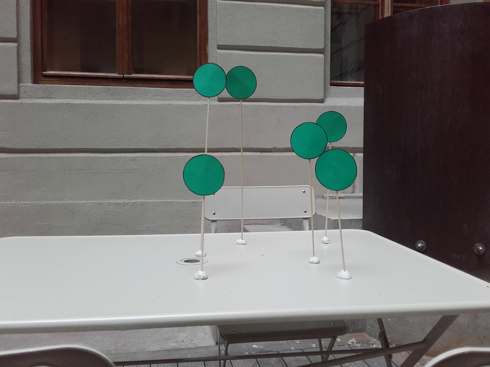

# Sapphire-FEDEX - The UNICEF project

_created by_ László Bogár and Lilla Tóth

## Project documentation

We have been created a program that is able to detect shapes on images and the results of the detections are stored in a database for later usage. 

We use the following technologies:
* MS Visual Studio 2017 with C++14
* SQLite 
* OpenCV library 

## Main expections

We have been created our program to help everyday work of UNICEF Hungary’s experienced volunteers. The members of the organization give interactive and playful classes to children between the 4th grade and the 12th about the UN Convention on the Rights of the Child. After each session participant children are asked to fill a feedback form on paper. The goal is to create an interactive software-hardware solution which is able to replace this paper-based feedback form. 

## Project pre-conditions and restrictions

There are two main pre-condition of the project. The first one is the program should be able to serve at least 20-30 children at a time. The second one is the children should be able to fill the feedback form without a mobile or a notebook. 

Our program fits to these pre-conditions with the following restrictions:

- children use green tables for answering (see bellow an example) and the enviroment where a class takes place should be free from green background, clothes, bags and so on. We need these restrictions because our program is specialized in green circles momently;
- the program should run on a computer which has a webcamera and the camera should take high quality pictures;
- the class, where the event is organized should be full with light;
- between answers you have to wait 15 seconds. 

## Usage of database

The database has three functions. The first is called createDatabase which creates a database to store your data. Every question has an own table and there is one extra table for the events to connect the rest tables. If these already exist, the function does nothing. The second is called createID which duty is to create a unique ID for each event which also stored in the database. After every question the insertData function is called to save the detected answers (see below). 

## How to use this program

The members of the organization give a table to each child. All question and answer are introduced in speech or showed by a projector and when a child realizes that an upcoming answer is fit to his/her opinion, he/she raises a green table in front of a camera - currently a webcamera - that it shots a picture. If there is any problem with the camera, for example it is not enable, the program sends an error messege (see below).
Between every answer the program waits 15 seconds to children have enough time to hear/read the next answer and decide the answer is fit to their opinion. Before picture shots an upcoming window signs the expiration of time (see below). After this procedure the computer evaluates the picture and stores the number of detected shapes. 

## Images

 - image about circle detection:
 

 - image about "Hands up!"
 

 
  - image about the database and a query
 

   
  - image about web camera error
 

 
 